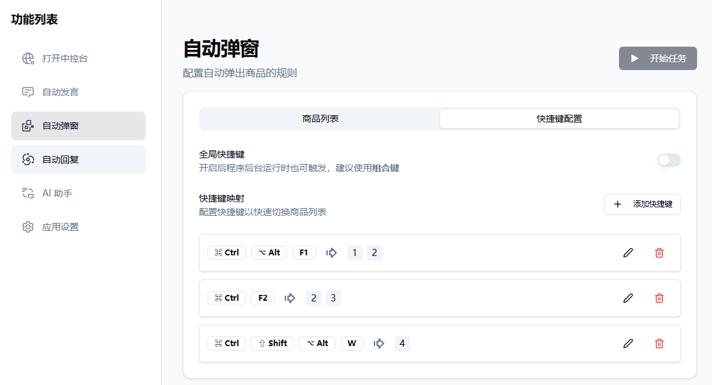
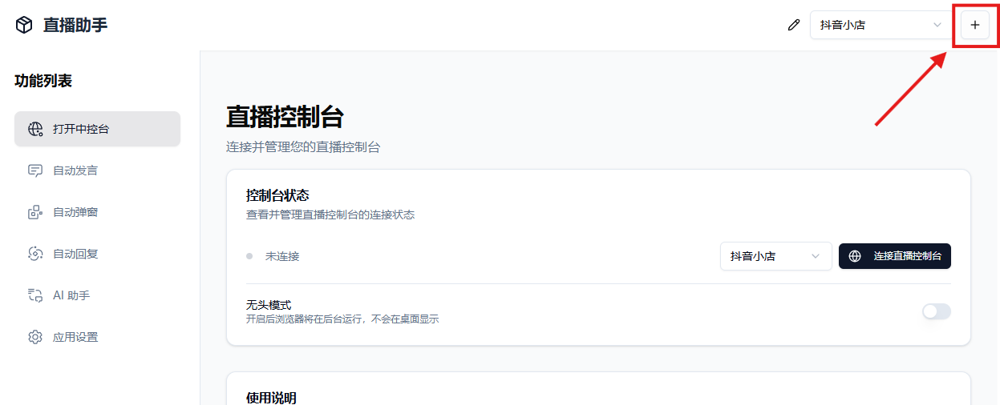

<div align="center">

  
  <h1> TLS live tool </h1>
  <p> 抖音小店/巨量百应/抖音团购/小红书/视频号/快手小店/淘宝直播小工具 </p>
  <br>

[![GitHub Release][github release badge]](https://github.com/TuoLingTeam/TLS-live-tool/releases/latest)
![GitHub][github license badge]
[](https://deepwiki.com/qiutongxue/oba-live-tool)
 
</div>

---

## 📸 界面预览


## ✨ 功能

🍟 **多账号管理**：支持多组账号配置，针对不同直播间使用不同的配置

🎯 **智能消息助手**：自动发送消息，告别重复机械喊话

📦 **商品自动讲解**：自动商品弹窗，随心所欲弹讲解

💃 **AI 自动回复**：实时监听直播互动评论、自动生成回复内容（仅限抖音小店/巨量百应/视频号/小红书）

🤖 **AI 智能助理**：接入 DeepSeek，支持官方、OpenRouter、硅基流动、火山引擎等所有支持 openai chat接口的提供商

## 🚀 快速开始

### 系统要求

- 操作系统：Windows 10 及以上 | MacOS 也能试试
- 浏览器：电脑上需要安装 Chrome 或 Edge 浏览器
- 抖音小店/巨量百应/抖音团购/小红书千帆：账号需要能正常进入中控台

### 下载安装

访问 [Releases](https://github.com/TuoLingTeam/TLS-live-tool/releases/latest) 页面下载最新版本安装包

### 源码构建

```bash
git clone https://github.com/TuoLingTeam/TLS-live-tool.git
cd TLS-live-tool
pnpm install
pnpm build
# 构建在项目根目录的 /release 文件夹下
```


## 📖 使用方法

### 第一步：连接到中控台

> [!TIP]
> 自动发言、自动弹窗、自动回复功能都需要先连接到中控台才能使用。

1. 点击功能列表的「打开中控台」进入直播控制台页面，点击「连接直播控制台」按钮
   > 如果软件显示找不到浏览器，或者想要自己指定浏览器位置，请前往 **应用设置** 页面的 **浏览器设置** 中进行相关设置。
2. 如果是第一次连接，请在弹出的页面中登录账号
3. 等待控制台状态显示绿色圆点和「已连接」，即连接成功
4. 部分平台如视频号、淘宝需要先开播后再连接

> [!IMPORTANT]
> **注意**：连接前请注意「无头模式」是否开启。在无头模式下，浏览器将在后台运行，不会显示浏览器窗口，无法查看网页状态。如果需要在连接后查看浏览器窗口，请关闭无头模式。

### 自动弹窗



#### 快捷键

自动弹窗可设置快捷键映射一个或多个商品，按下快捷键后将按照快捷键设置的商品进行弹窗
  - 快捷键`当且仅当`在自动弹窗页面激活，切换其它页面后将无法使用快捷键（包括全局快捷键）
  - 全局快捷键：开启全局快捷键后，即使软件最小化后台运行也能正常使用。
    - 注意：请务必使用**组合快捷键**，且不要和系统或其它软件的常用快捷键相同，避免造成键位冲突。


### 自动发言

#### 变量

自动发言可以使用变量如 `{候选A/候选B/候选C}`，一组候选项由一对大括号 `{}` 包裹，一组中各个候选项由斜杠 `/` 隔开。
发送消息时，系统会自动从每一组候选项中随机选取一项，与剩余文本拼接

> 如某行设置了 `{老铁/宝宝/家人们}可以看看我们的{一号/二号}链接哦`，可能发送的内容为：
> - 老铁可以看看我们的一号链接哦
> - 宝宝可以看看我们的一号链接哦
> - 家人们可以看看我们的一号链接哦
> - 老铁可以看看我们的二号链接哦
> - 宝宝可以看看我们的二号链接哦
> - 家人们可以看看我们的二号链接哦


#### 部分功能说明

- 置顶：点击行号左侧的置顶📌图标即可设置（取消设置）置顶。置顶选项仅适用于提供了评论置顶功能的平台（如抖音小店、巨量百应、快手小店等）。
- 随机空格：防止重复消息被系统屏蔽。采用的是可见的空格字符，可能会带来文字排版上的问题。
- 一键刷屏：使用消息列表中的消息连续发送，自带随机空格。

> [!NOTE]
> 目前暂时还没提供运行时更新设置的功能，所以如果需要让新的任务配置生效，需要**重启任务**。

### 自动回复

> [!TIP] 
> 自动回复目前只支持**抖音小店/巨量百应/视频号/小红书**这四个平台

自动回复目前可以通过两种方式监听直播互动信息：

1. 中控台的直播互动窗口：只有评论互动内容
2. 直播大屏主播版（抖音小店/巨量百应）：拥有评论互动、进入直播间、点赞、加入品牌会员、关注直播间、加入粉丝团、下单信息

#### 注意事项

- 请预先在自动回复的**设置**里设置好要回复的内容 
- **关键词回复**和**AI回复**可以同时设置，在同时设置的情况下，若命中了关键词则优先使用关键词回复，未命中情况下才会执行AI回复
  - 若重复的**关键词**出现在多个规则中，优先使用序号靠前的规则
- 入场、点赞等额外互动消息的自动回复等功能只有把入口设置为**罗盘大屏**时才生效
- 程序会自动将回复内容里的所有 `{用户名}`替换为实际的用户昵称，你可以灵活调整`{用户名}`出现的位置
  - 比如此时进入直播间的用户叫张三，且设置了自动回复的内容为 `@{用户名} 欢迎来到直播间`，实际发送的内容为 `@张三 欢迎来到直播间`
    - 如果设置了隐藏用户名，实际发送的内容为 `@张*** 欢迎来到直播间`
- 自动回复支持[变量](#变量)文本，详情请参考上方[自动发言](#自动发言)
- 当配置了多条回复内容时，程序会随机选择一条发送
- 先点击**开始监听**按钮准备开始监听评论消息，监听成功后**开始任务**才能正常执行自动回复。


##### 关键词回复

关键词回复支持使用批量编辑，与自动发言的配置相同，可以在一个文本框中编辑多个关键词回复信息，每行对应一条规则。

在一条规则中，关键词使用 `/` 作为区分，如 `关键词A/关键词B/关键词C`,回复内容用 `|` 作为区分，如 `回复内容a|回复内容b|回复内容c`。关键词和回复内容之间使用 `|` 隔开，且关键词要放在规则首位。

> 如一条规则的文本内容为 `音响/音箱/低音炮|宝宝，咱们的蓝牙音箱在142号连接，您可以划动小黄车去看看|@{用户名} 咱们142号链接就是蓝牙音响哦`
> 
> 其对应的规则为：关键词：[音响, 音箱, 低音炮]
> 
> 回复内容1：宝宝，咱们的蓝牙音箱在142号连接，您可以划动小黄车去看看
> 
> 回复内容2：@{用户名} 咱们142号链接就是蓝牙音响哦
> 
> *注*：`{用户名}`会被自动替换为实际的用户名

##### AI回复

1. [设置好你的 API KEY 及模型](#api-key-设置)，确保可用。
2. 在「提示词配置」中设置好相关的提示词。
  > 提示词决定了 AI 会扮演什么样的角色，以及 AI 会如何回答用户的问题，会计入 token 消耗。

开启 AI 回复时，程序会将「开始任务」之后的新的用户评论交给 AI 处理，用户评论会以 JSON 格式原封不动地作为对话的内容交给 AI：

```JSON
{
  "nickname": "用户昵称",
  "content": "用户评论内容",
}
```

所以可以把 `nickname`、`commentTag` 等插入到提示词中，你的提示词可以是：

```md
你是一个直播间的助手，负责回复观众的评论。请参考下面的要求、产品介绍和直播商品，用简短友好的语气回复，一定一定不要超过45个字。

## 要求

- 回复格式为：@<nickname第一个字符>*** <你的回复> （注意！：三个星号是必须的）
...
```

#### WebSocket 服务

WebSocket 功能负责将监听到的评论信息广播到所有连接的客户端。可以在自动回复的设置页面中开启 WebSocket 服务，并配置相应的端口号。开启 WebSocket 并点击「开始监听」后，应用会自行启动 WebSocket **服务端**，绑定本机所有 ip 接口（`0.0.0.0`）。

发送格式为 JSON 字符串，[类型定义参照这里](https://github.com/qiutongxue/oba-live-tool/blob/3c482728ac94ab33c76e072ed0424f9507a9dc3f/shared/types.d.ts#L84-L171)

### AI 助手

AI 助手只支持文本对话，在使用 AI 助手功能前，请先设置好你的 API KEY 及模型，确保可用。

### API KEY 设置

想要使用 AI 功能，需要先设置 API KEY。

软件提供了四种 DeepSeek 模型的预设：

- [DeepSeek](https://platform.deepseek.com/)
- [OpenRouter](https://openrouter.ai/)
- [硅基流动](https://www.siliconflow.cn/)
- [火山引擎](https://console.volcengine.com/ark/)

除此之外，「自定义」还支持几乎任何兼容 openai 对话模型接口的服务。

在 「AI 助手」或「自动回复」的页面，点击「配置 API Key」按钮，就能选择自己需要的提供商和模型了。

**注意:** 有的（大多数）模型是收费的，使用 AI 功能前请一定要先了解清楚，使用收费模型时请确保自己在提供商的账户有能够消耗的额度。

#### 火山引擎

火山引擎的设置方式和其它提供商有些微区别，除了需要 API KEY 之外，还需要 [创建接入点](https://console.volcengine.com/ark/region:ark+cn-beijing/endpoint)。创建成功后，将接入点的 id 复制到原先选择模型的位置中即可使用。


### 其它

#### 多开/多账号

软件并不支持多开，但是支持设置多个账号，各个账号之间的环境以及任务是独立的，并且能够同时运行。

可以通过软件界面点击右上角的加号按钮添加新账号。新账号除了部分通用设置外的所有设置，包括浏览器上下文环境都是独立的，所以不用担心新旧账号同时运行会产生冲突（除非你连接同一个中控台）



##### 删除账号

可在「应用设置」-「删除账号」中删除当前账号。但是**默认账号**（即第一个账号）无法删除！

> 这里的删除账号是指删除当前账号对应中控台任务的所有设置，并不会真的删除一个平台账号。

#### 软件更新

当前暂时只通过 Github Release 分发。你可以选择或自定义加速代理源，当然，也只是普通的代理加速。

设置自定义代理加速方式如下：

1. 找到一个能够代理加速 github release 的站点，如 `gh-proxy.com`
2. 查看站点提供的加速地址，如下载 1.5.20-windows-x64 版本的地址可以是 `https://gh-proxy.org/https://github.com/qiutongxue/oba-live-tool/releases/download/v1.5.20/oba-live-tool_1.5.20_windows_x64.exe`
3. 把 `https://github.com/……` 及后面的链接删除，保留前缀 `https://gh-proxy.org/`
4. 将前缀地址复制到自定义更新源输入框中

亲测：Github 绝对可用。`gh-proxy.com` 偶尔可用。其余的github代理基本都不可用。

#### 开发者模式

启用开发者模式后，可以使用鼠标右键菜单，在菜单中可打开开发者工具。

## 📑 许可证

本项目遵循 MIT 许可证

## Star History

[](https://www.star-history.com/#TLS-802/TLS-live-tool&Date)

<!-- badage -->

[github release badge]: https://img.shields.io/github/v/release/TLS-802/TLS-live-tool?style=flat&logo=github&labelColor=%2324292e&color=%231a7f37


[github license badge]: https://img.shields.io/badge/license-MIT-5c6bc0?style=flat&labelColor=24292e

