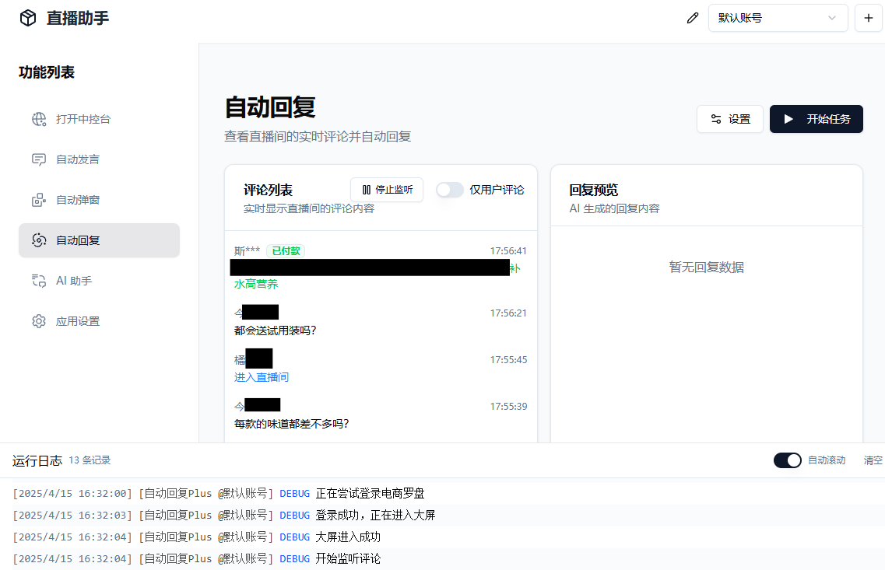
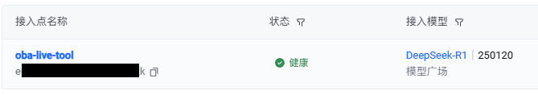

<div align="center">

  
  <h1> oba live tool </h1>
  <p> 抖音小店/巨量百应/抖音团购/小红书直播小工具 </p>
  <br>

![GitHub Release][github release badge]
![GitHub Release Date][github release date badge]
![GitHub][github license badge]

</div>

---

## 📸 界面预览




## ✨ 功能

🍟 **多账号管理**：支持多组账号配置，针对不同直播间使用不同的配置

🎯 **智能消息助手**：自动发送消息，告别重复机械喊话

📦 **商品自动讲解**：自动商品弹窗，随心所欲弹讲解

💃 **AI 自动回复**：实时监听直播互动评论（包括进入直播间、点赞、关注、加入品牌会员、加入粉丝团、下单信息等）、自动生成回复内容

🤖 **AI 智能助理**：接入 DeepSeek，支持官方、OpenRouter、硅基流动、火山引擎等所有支持 openai chat接口的提供商

## 🚀 快速开始

### 系统要求

- 操作系统：Windows 10 及以上 | MacOS 也能试试
- 浏览器：电脑上需要安装 Chrome 或 Edge 浏览器
- 抖音小店/巨量百应/抖音团购/小红书千帆：账号需要能正常进入中控台

### 下载安装

访问 [Releases](https://github.com/qiutongxue/oba-live-tool/releases/latest) 页面下载最新版本安装包

### 源码构建

```bash
git clone https://github.com/qiutongxue/oba-live-tool.git
cd oba-live-tool
pnpm install
pnpm build
# 构建在项目根目录的 /release 文件夹下
```


## 📖 使用方法

### 第一步：连接到中控台

> 自动发言、自动弹窗、自动回复功能都需要先连接到中控台才能使用。

1. 点击功能列表的「打开中控台」进入直播控制台页面，点击「连接直播控制台」按钮
   > 如果软件显示找不到浏览器，或者想要自己指定浏览器位置，请前往 **应用设置** 页面的 **浏览器设置** 中进行相关设置。
2. 如果是第一次连接，请在弹出的页面中登录账号
3. 等待控制台状态显示绿色圆点和「已连接」，即连接成功

> 抖音小店和巨量百应理论上支持所有功能，抖音团购和小红书暂时只支持弹窗和自动发言

### 自动弹窗和自动发言

#### 自动弹窗

- 自动弹窗的商品 ID 为直播间上架商品的序号（从 1 开始），并非商品的真实 ID！

#### 自动发言

- 抖音团购和小红书没有提供置顶功能，所以勾选了置顶也没用

> 目前暂时还没提供运行时更新设置的功能，所以如果需要让新的任务配置生效，需要**重启任务**。

### 自动回复

> 自动回复目前只支持**抖音小店/巨量百应**两个平台

自动回复目前可以通过两种方式监听直播互动信息：

1. 中控台的直播互动窗口：只有评论互动内容
2. 直播大屏主播版：拥有评论互动、进入直播间、点赞、加入品牌会员、关注直播间、加入粉丝团、下单信息

#### 注意事项

- 请预先在自动回复的**设置**里设置好要回复的内容 
- **关键词回复**和**AI回复**可以同时设置，在同时设置的情况下，若命中了关键词则优先使用关键词回复，未命中情况下才会执行AI回复
  - 若重复的**关键词**出现在多个规则中，优先使用序号靠前的规则
- 入场、点赞等额外互动消息的自动回复等功能只有把入口设置为**罗盘大屏**时才生效
- 程序会自动将回复内容里的所有 `{用户名}`替换为实际的用户昵称，你可以灵活调整`{用户名}`出现的位置
  - 比如此时进入直播间的用户叫张三，且设置了自动回复的内容为 `@{用户名} 欢迎来到直播间`，实际发送的内容为 `@张三 欢迎来到直播间`
    - 如果设置了隐藏用户名，实际发送的内容为 `@张*** 欢迎来到直播间`
- 当配置了多条回复内容时，程序会随机选择一条发送
- 先点击**开始监听**按钮准备开始监听评论消息，监听成功后**开始任务**才能正常执行自动回复。

##### AI回复

1. [设置好你的 API KEY 及模型](#api-key-设置)，确保可用。
2. 在「提示词配置」中设置好相关的提示词。
  > 提示词决定了 AI 会扮演什么样的角色，以及 AI 会如何回答用户的问题，会计入 token 消耗。

开启 AI 回复时，程序会将「开始任务」之后的新的用户评论交给 AI 处理，用户评论会以 JSON 格式原封不动地作为对话的内容交给 AI：

```JSON
{
  "nickname": "用户昵称",
  "content": "用户评论内容",
}
```

所以可以把 `nickname`、`commentTag` 等插入到提示词中，你的提示词可以是：

```md
你是一个直播间的助手，负责回复观众的评论。请参考下面的要求、产品介绍和直播商品，用简短友好的语气回复，一定一定不要超过45个字。

## 要求

- 回复格式为：@<nickname第一个字符>*** <你的回复> （注意！：三个星号是必须的）
...
```

### AI 助手

AI 助手只支持文本对话，在使用 AI 助手功能前，请先设置好你的 API KEY 及模型，确保可用。

### API KEY 设置

想要使用 AI 功能，需要先设置 API KEY。

软件提供了四种 DeepSeek 模型的预设：

- [DeepSeek](https://platform.deepseek.com/)
- [OpenRouter](https://openrouter.ai/)
- [硅基流动](https://www.siliconflow.cn/)
- [火山引擎](https://console.volcengine.com/ark/)

除此之外，「自定义」还支持几乎任何兼容 openai 对话模型接口的服务。

在 「AI 助手」或「自动回复」的页面，点击「配置 API Key」按钮，就能选择自己需要的提供商和模型了。

**注意:** 有的（大多数）模型是收费的，使用 AI 功能前请一定要先了解清楚，使用收费模型时请确保自己在提供商的账户有能够消耗的额度。

#### 火山引擎

火山引擎的设置方式和其它提供商有些微区别，除了需要 API KEY 之外，还需要 [创建接入点](https://console.volcengine.com/ark/region:ark+cn-beijing/endpoint)。创建成功后，将接入点的 id 复制到原先选择模型的位置中即可使用。



### 其它

#### 软件更新

你可以选择更新源，但是目前最稳定的还是 Github。

亲测：Github 绝对可用。`gh-proxy.com` 偶尔可用。其余的github代理基本都不可用。

#### 开发者模式

启用开发者模式后，可以使用鼠标右键菜单，在菜单中可打开开发者工具。

启用开发者模式后，连接到中控台时会关闭浏览器的无头模式。

## 📑 许可证

本项目遵循 MIT 许可证

<!-- badage -->

[github release badge]: https://img.shields.io/github/v/release/qiutongxue/oba-live-tool?style=for-the-badge

[github release date badge]: https://img.shields.io/github/release-date/qiutongxue/oba-live-tool?style=for-the-badge

[github license badge]: https://img.shields.io/badge/license-MIT-yellow?style=for-the-badge
