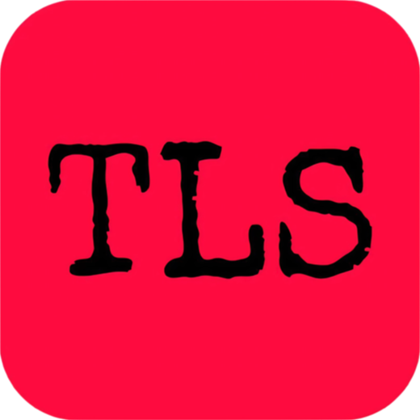
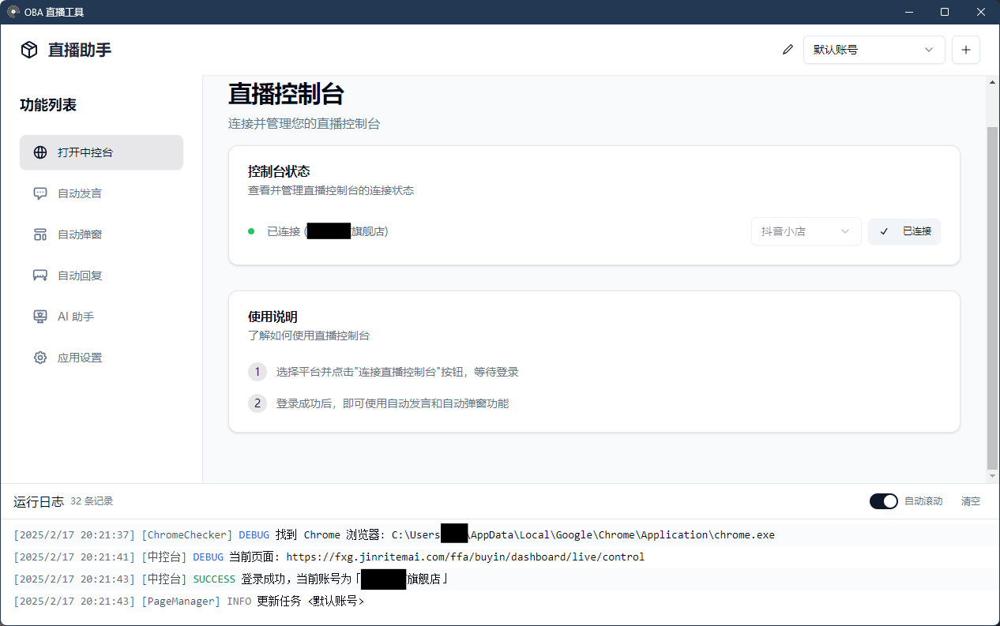
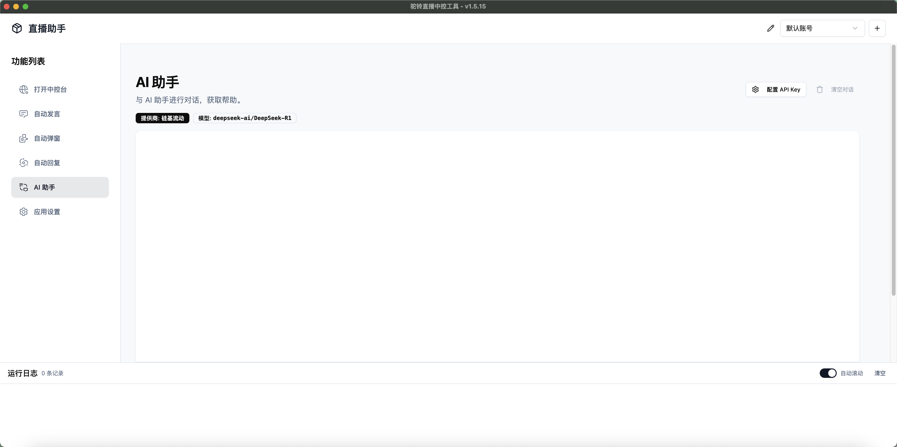
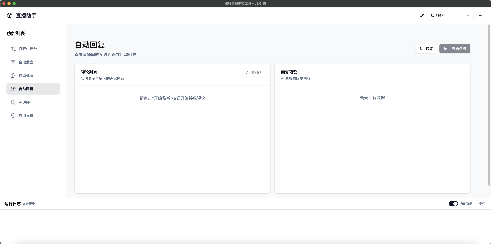

<div align="center">

  
  <h1> oba live tool </h1>
  <p> 抖音小店直播小工具 </p>
  <br>

![GitHub Release][github release badge]
![GitHub Release Date][github release date badge]
![GitHub][github license badge]

</div>

---

## 📸 界面预览







## ✨ 功能

🎯 **智能消息助手**：自动发送消息，告别重复机械喊话

📦 **商品自动讲解**：自动商品弹窗，随心所欲弹讲解

💃 **AI 自动回复**：实时监听直播互动评论、自动生成回复内容

🤖 **AI 智能助理**：接入 DeepSeek，支持官方、OpenRouter、硅基流动三种入口

## 🚀 快速开始

### 系统要求

- 操作系统：Windows 10 及以上
- 浏览器：电脑上需要安装 Chrome 浏览器
- 抖音小店：账号需要能正常进入中控台

### 下载安装

访问 [Releases]([releases/latest](https://github.com/qiutongxue/oba-live-tool/releases/latest)) 页面下载最新版本安装包

### 源码构建

```bash
git clone https://github.com/qiutongxue/oba-live-tool.git
cd oba-live-tool
pnpm install
pnpm build
```

## 📖 使用方法

### 第一步：连接到中控台

> 自动发言、自动弹窗、自动回复功能都需要先连接到中控台才能使用。

1. 点击功能列表的「打开中控台」进入直播控制台页面，点击「连接直播控制台」按钮
   > 如果软件显示找不到 Chrome 浏览器，或者想要自己指定浏览器位置，请前往 **应用设置** 页面的 **浏览器设置** 中进行相关设置。
2. 如果是第一次连接，请在弹出的页面中登录抖音小店的账号
3. 等待控制台状态显示绿色圆点和「已连接」，即连接成功

### 自动弹窗和自动发言

基本功能就不多说了，有一个需要注意的：

目前暂时还没提供运行时更新设置的功能，所以如果需要让新的任务配置生效，需要重启任务。

### API KEY 设置

想要使用 AI 功能，需要先设置 API KEY。

软件目前只支持以下三个提供商的 deepseek 文生文模型（~~其实理论上兼容 openai 库的都能用，但是我还没搞自定义~~）：

- [DeepSeek](https://platform.deepseek.com/)
- [OpenRouter](https://openrouter.ai/)
- [硅基流动](https://www.siliconflow.cn/)

在 「AI 助手」或「自动回复」的页面，点击「配置 API Key」按钮，就能选择自己需要的提供商和模型了。

**注意:** 有的（大多数）模型是收费的，使用 AI 功能前请一定要先了解清楚，使用收费模型时请确保自己在提供商的账户有能够消耗的额度。

### 自动回复

在使用自动回复功能前，请先

1. 设置好你的 API KEY 及模型，确保可用。

2. 在「提示词配置」中设置好相关的提示词。
  > 提示词决定了 AI 会扮演什么样的角色，以及 AI 会如何回答用户的问题，会计入 token 消耗。

程序会将「开始任务」之后的新的用户评论交给 AI 处理，用户评论会以 JSON 格式原封不动地作为对话的内容交给 AI：

```JSON
{
  "nickname": "用户昵称",
  "content": "用户评论内容",
  "commentTag": ["评论标签1", "评论标签2", "..."]
}
```

所以可以把 `nickname`、`commentTag` 等插入到提示词中，你的提示词可以是：

```md
你是一个直播间的助手，负责回复观众的评论。请参考下面的要求、产品介绍和直播商品，用简短友好的语气回复，一定一定不要超过45个字。

## 要求

- 回复格式为：@<nickname第一个字符>*** <你的回复> （注意！：三个星号是必须的）
...
```

### AI 助手

在使用 AI 助手功能前，请先设置好你的 API KEY 及模型，确保可用。

### 其它

#### 软件更新

你可以选择更新源，但是目前最稳定的还是 Github。

亲测：Github 绝对可用。`gh-proxy.com` 偶尔可用。其余的github代理基本都不可用。

#### 开发者模式

启用开发者模式后，可以使用鼠标右键菜单，在菜单中可打开开发者工具。

启用开发者模式后，连接到中控台时会关闭浏览器的无头模式。

## 🔗 相关链接

- [问题反馈](issues)
- [功能建议](issues/new)

## 📑 许可证

本项目遵循 MIT 许可证

<!-- badage -->

[github release badge]: https://img.shields.io/github/v/release/qiutongxue/oba-live-tool?style=for-the-badge

[github release date badge]: https://img.shields.io/github/release-date/qiutongxue/oba-live-tool?style=for-the-badge

[github license badge]: https://img.shields.io/github/license/qiutongxue/oba-live-tool?style=for-the-badge
